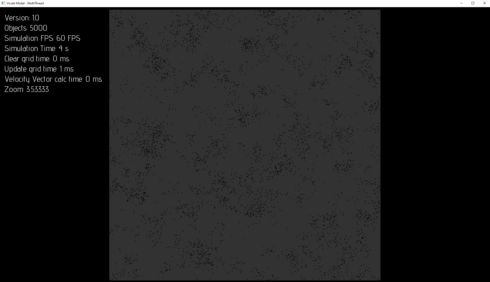
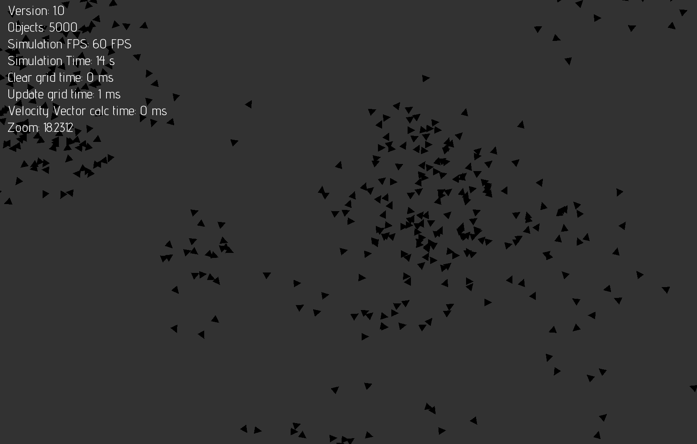

# Vicsek Model Implementation

## Overview

This project is an implementation of the Vicsek model, a computational model that simulates the collective motion of self-propelled particles. The behavior is inspired by the flocking of birds, schools of fish, and other group behaviors observed in nature. The implementation is done in C++ using the SFML library for graphics.

## Based on

This project is based on the work of [VerletSFML-Multithread](https://github.com/johnBuffer/VerletSFML-Multithread) by Jean Tampon. The original project served as a foundation, and this implementation builds upon it to explore the Vicsek model.

## Features

- Simulates the collective behavior of particles.
- Utilizes the Vicsek model for self-organization.
- Written in C++ with SFML for visualization.

## Getting Started

To build and run the project, follow these steps:

1. Clone the repository: `git clone https://github.com/your-username/vicsek-model.git`
2. Build the project using your preferred C++ compiler.
3. Run the executable.

## Screenshot

## License

This project is licensed under the MIT License - see the [LICENSE](LICENSE) file for details.
